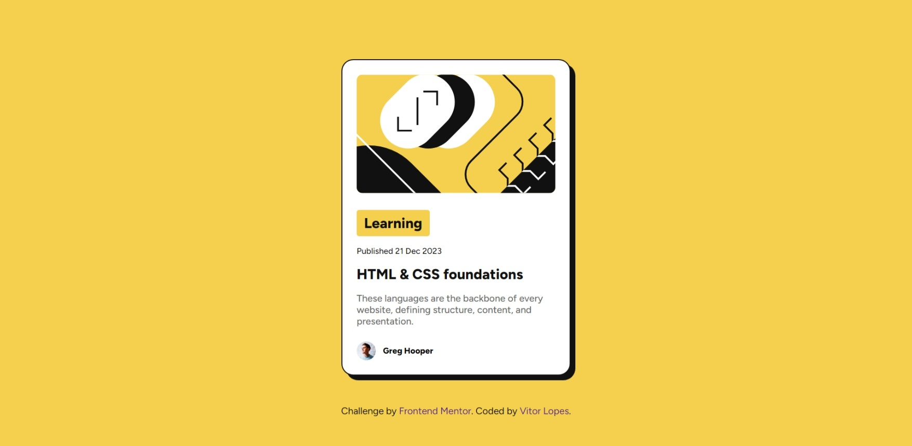

# Frontend Mentor - Blog preview card solution

This is a solution to the [Blog preview card challenge on Frontend Mentor](https://www.frontendmentor.io/challenges/blog-preview-card-ckPaj01IcS). Frontend Mentor challenges help you improve your coding skills by building realistic projects. 

## Table of contents

- [The challenge](#the-challenge)
- [Screenshot](#screenshot)
- [Links](#links)
- [Built with](#built-with)
- [What I learned](#what-i-learned)
- [Useful resources](#useful-resources)
- [Author](#author)


## The challenge

Users should be able to:

- See hover and focus states for all interactive elements on the page

## Screenshot



## Links

- Solution URL: [Add solution URL here](https://your-solution-url.com)
- Live Site URL: [Vercel](https://blog-preview-card-xi-roan.vercel.app/)


## Built with

- Semantic HTML5 markup
- CSS custom properties
- Flexbox


## What I learned

This was a great project for practicing FlexBox and using relative units like '%' and 'rem'. I was able to learn a lot about positioning elements on the screen, using properties like 'width', 'height', 'max-width', etc., correctly, and understanding why they're used in some situations and not in others.

max-width was very helpful in the code below:

``` css
  .card-container {
    display: flex;
    flex-direction: column;
    justify-content: flex-start;
    align-items: flex-start;
    gap: 24px;
    max-width: 24rem;
    padding: 24px;
    border: 2px solid var(--main-color);
    border-radius: 20px;
    box-shadow: 8px 8px 0px 0px var(--main-color);
    background-color: var(--background-card);
}
```

## Useful resources

- [FrontEnd Mentor Discord](https://discord.gg/GATN92aF) - This server helped me a lot with  some questions I got.

## Author

- Frontend Mentor - [@vitordevlopes](https://www.frontendmentor.io/profile/vitordevlopes)
- Linkedin - [My profile](https://www.linkedin.com/in/vitorlopess/)